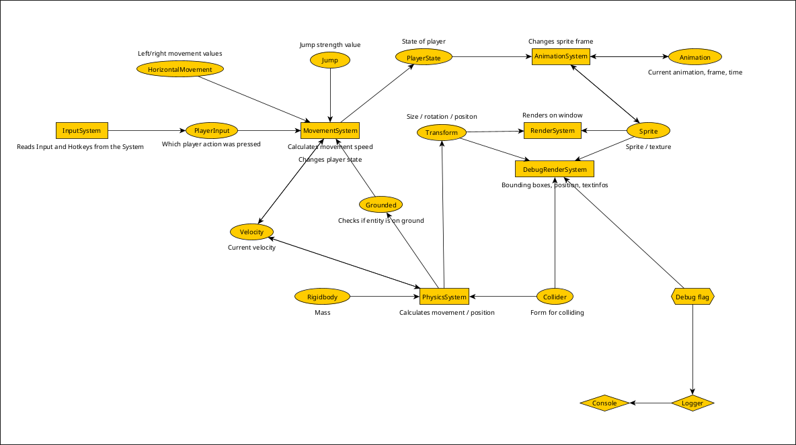

# TenshiEngine
### Game Engine for 2D Games with EntityComponentSystem (ECS)
### Written in C++/SFML

---

## Features
- **Entity Component System** - Dynamically add or modify components to entities at runtime
- **Systems** - Process and update Entities by reading/writing their components
- **SFML Rendering** - 2D Rendering with Sprites/Textures
- **Logger** - Console Logger with Debug Log
- **GameBase** - A ready-to-use game loop and render window setup

---
## Components / Systems
**A little graph to show what systems and components are in development and how they communicate with each other**



---

## Documentation
You can find the latest API documentation here: [TenshiEngine API Docs](https://Queltenshi.github.io/TenshiEngine/)

---

## Installation:
**Requirements**:
- C++ 17+
- [SFML](https://www.sfml-dev.org/) 3.0+
- [CMake](https://cmake.org/) 3.16+

**Linux**:
```bash
git clone https://github.com/Queltenshi/TenshiEngine.git
cd TenshiEngine
mkdir build
cd build
cmake .. -DCMAKE_BUILD_TYPE=Release
cmake --build . --config Release
sudo cmake --install . --prefix /usr/local

```

---

## Quick Start
**main.cpp**
``` cpp
#include <Game.h>

int main(){
    Game game;
    game.init();
    game.run();
    return 0;
}
```

**Game.cpp**
``` cpp
#include <TenshiEngine/Game/GameBase.hpp>

class Game : public te::GameBase {
public:
    Game();
    
    void init(){
        GameBase::init();
        if(!mPlayerTexture.loadFromFile("Path/to/Texture"))
            std::cout << "Texture could not be loaded" << std::endl;
        mPlayer = mRegistry.createEntity(mPlayerTexture);
}

private:
    sf::Texture mPlayerTexture;
    te::Entity mPlayer;
};
```
---

## Contributing
This project is currently maintained solely by the author.  
External contributions, pull requests, or forks are welcome for personal use or experimentation,  
but they will **not be merged** into the main repository at this time.

---

## Changelog
See the full changelog [here](CHANGELOG.md).

---

## License
This project is licensed under the GNU GPL v3  
It uses [SFML](https://www.sfml-dev.org/), which is licensed under the zlib/libpng license
